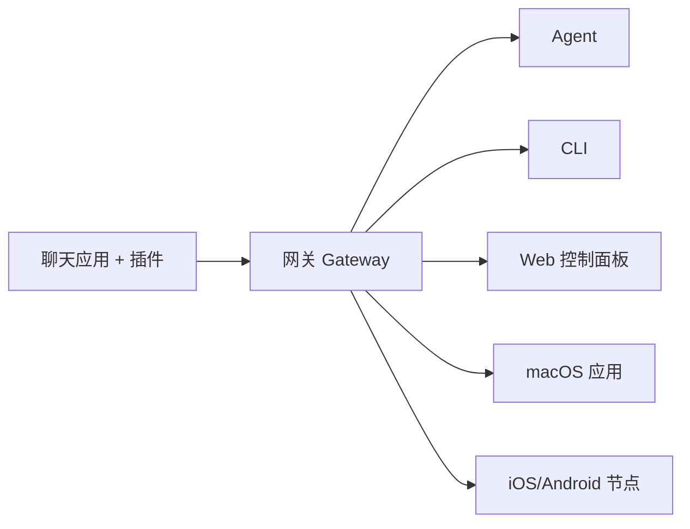

# 架构概述 🏗️

OpenClaw 是一个基于 Node.js 的多渠道 AI Agent 网关，采用异步架构设计，支持高并发连接和灵活的消息路由。

## 系统架构图



## 核心组件

### 1. 网关 (Gateway)

网关是所有会话、路由和渠道连接的核心数据源。它：
- 管理所有渠道的连接
- 处理消息路由和会话管理
- 提供 REST API 和 WebSocket 接口
- 默认监听端口 18789

### 2. 渠道层 (Channels)

渠道层支持多种聊天平台：

| 渠道 | 状态 | 说明 |
|------|------|------|
| Telegram | 内置 | 通过 Bot Token 连接 |
| Discord | 内置 | 通过 Webhook 连接 |
| WhatsApp | 内置 | 通过 WhatsApp Web |
| Signal | 插件 | 第三方插件支持 |
| Slack | 内置 | 通过 Bot Token |
| Microsoft Teams | 内置 | 通过 Bot Framework |
| iMessage | 插件 | 第三方插件支持 |
| Matrix | 插件 | 第三方插件支持 |
| Feishu | 内置 | 通过飞书 Bot API |

### 3. Agent 层

Agent 层负责处理 AI 对话：

- **会话管理**：每个发送者拥有独立的会话
- **工具调用**：支持文件、系统命令、网络搜索等
- **记忆系统**：两阶段记忆整合
- **多 Agent 路由**：支持工作区隔离

### 4. 控制面板 (Control UI)

Web 控制面板提供：
- 聊天界面
- 配置管理
- 会话查看
- 节点管理

## 技术栈

- **运行时**：Node.js 22+ (推荐 Node 24)
- **框架**：TypeScript/Node.js 异步架构
- **协议**：REST API、WebSocket、SSE
- **部署**：支持 Docker、本地安装

## 消息流

```
用户消息 → 渠道适配器 → 网关 → Agent → AI 提供商
                ↑                              ↓
                ← ← ← ← ← 响应 ← ← ← ← ← ← ← ←
```

## 配置

配置存储在 `~/.openclaw/openclaw.json`：

```json5
{
  channels: {
    telegram: {
      enabled: true,
      botToken: "YOUR_BOT_TOKEN",
    },
    whatsapp: {
      allowFrom: ["+155****0123"],
    },
  },
  providers: {
    openai: {
      apiKey: "YOUR_API_KEY",
    },
  },
}
```

## 安全特性

- 令牌和凭证管理
- 允许列表控制
- 群组提及规则
- 安全沙箱

## 了解更多

- [渠道详细文档](/openclaw/channels)
- [API 参考](/openclaw/api)
- [工具系统](/openclaw/tools)
