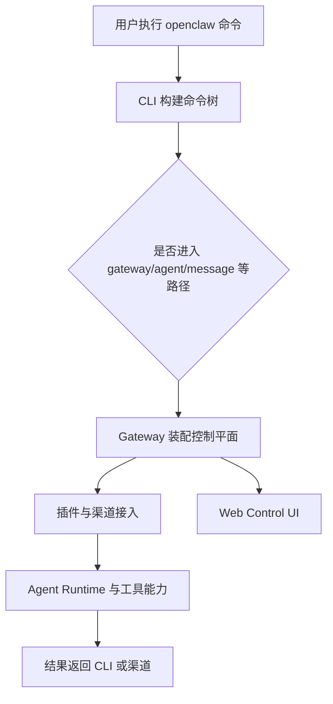

# openclaw 专题：Gateway、Agent 与渠道扩展

## 1. 文档目的

这份专题文档聚焦 `openclaw` 最值得继续深挖的 3 个系统中枢：

1. Gateway 为什么是整个系统的控制平面
2. CLI 命令体系如何把产品能力组织起来
3. 渠道插件与扩展如何接入统一运行时

核心阅读落点主要是：

- `openclaw.mjs`
- `src/entry.ts`
- `src/cli/run-main.ts`
- `src/cli/program/build-program.ts`
- `src/cli/gateway-cli/run.ts`
- `src/gateway/server.impl.ts`
- `src/channels/plugins/index.ts`
- `extensions/*`

## 2. 先给结论

如果只抓住主干，可以先记住 3 句话：

- `openclaw.mjs` 到 `src/cli/program/build-program.ts` 决定“用户有哪些命令入口”
- `src/gateway/server.impl.ts` 决定“系统的控制平面如何被装起来”
- `src/channels/plugins/index.ts` 与 `extensions/*` 决定“新渠道怎样以插件方式接进来”

## 3. Gateway 专题

### 3.1 Gateway 为什么是控制平面

从技术方案可以看出，Gateway 不是单个服务端点，而是多个能力的汇聚面：

- WebSocket 运行时
- 渠道接入
- 会话管理
- 插件装配
- Web 控制台静态资源服务
- Agent 请求转发

这就是为什么文档把它定义为“控制平面”，而不是普通 API 服务。

### 3.2 Gateway 的主链路

理解 Gateway，建议先抓这条链：

1. `openclaw gateway`
2. `src/cli/gateway-cli/run.ts`
3. `startGatewayServer()`
4. `src/gateway/server.impl.ts`
5. `src/gateway/server-ws-runtime.ts`

这条链能回答两个关键问题：

- Gateway 是怎么被命令层启动的
- Gateway 内部是怎么把 WS、插件、渠道和 UI 拼起来的

### 3.3 为什么 Agent 默认经 Gateway 工作

技术方案里已经明确提示，`openclaw agent` 的主推荐路径更偏向“经 Gateway 调 Agent”。

这说明项目架构倾向于：

- 让控制、状态和扩展集中在 Gateway
- 让 CLI 更像控制入口，而不是所有逻辑都在本地单进程直跑

## 4. 命令体系专题

### 4.1 命令体系不是外壳，而是产品目录

`openclaw` 的命令面很宽，核心命令簇至少包括：

- 引导：`setup`、`onboard`、`configure`
- 诊断：`doctor`、`status`、`health`
- 服务：`gateway`、`daemon`、`logs`
- 交互：`agent`、`message send`
- 自动化：`browser`

这意味着命令体系本身就是产品能力地图，而不是薄薄一层 CLI 包装。

### 4.2 建议优先看的代码

要理解命令怎么装起来，优先看：

1. `src/cli/program/build-program.ts`
2. `src/cli/program/command-registry.ts`
3. `src/cli/program/register.agent.ts`
4. `src/cli/gateway-cli/run.ts`

看完这一层，再回头读 `myDocs/openclaw_command.md`，会更容易把“帮助树”和“真实实现”对上。

### 4.3 命令验证为什么要分层

该项目的很多命令并不是纯本地、纯只读：

- `onboard` 可能需要人工交互
- `status`、`health` 可能依赖 Gateway 已启动
- `browser`、`message` 可能依赖设备或渠道上下文

因此验证命令时应区分：

- 入口命令是否存在
- 命令实现是否能被加载
- 外部依赖是否满足

## 5. 渠道扩展专题

### 5.1 为什么要做插件化

项目同时覆盖 Telegram、Slack、Discord、Matrix 等渠道，如果每个渠道都直接写进主循环，维护成本会很快失控。

因此当前设计选择了：

- 核心运行时保持稳定
- 渠道能力通过插件注册表接入
- 具体实现下沉到 `extensions/*`

### 5.2 最关键的两个阅读点

- `src/channels/plugins/index.ts`
- `extensions/*`

前者负责回答“系统怎么发现渠道”，后者负责回答“某个渠道如何落地实现”。

### 5.3 UI 为什么也要放进这条链

`scripts/ui.js` 与 `ui/` 的作用，不只是构建前端，而是把控制台产物输送到 `dist/control-ui`，再由 Gateway 统一服务。

这说明：

- Web UI 不是完全独立系统
- 它仍然是控制平面的一部分

## 6. 三个子系统怎么协作

这张图对应的核心判断是：

- 命令层负责暴露入口
- Gateway 负责收敛运行时
- 渠道层负责扩展外部接入面

## 7. 建议阅读顺序

1. `myDocs/openclaw_command.md`
2. `openclaw.mjs`
3. `src/entry.ts`
4. `src/cli/run-main.ts`
5. `src/cli/program/build-program.ts`
6. `src/cli/gateway-cli/run.ts`
7. `src/gateway/server.impl.ts`
8. `src/channels/plugins/index.ts`
9. `extensions/*`
10. `scripts/ui.js`

## 8. 开放性问题

1. Gateway 与本地嵌入式 Agent 路径未来是否会继续并存，还是会逐步统一到更清晰的控制平面模型？
2. `openclaw.mjs --help` 能输出帮助却未自然退出，是否暴露了某些命令初始化副作用不够纯净？
3. 渠道插件的生命周期、故障隔离和权限边界，是否已经足够稳定到可以形成统一插件契约？
4. 若项目继续强化 Windows 原生支持，哪些 `bash` 依赖与构建路径需要优先治理？
