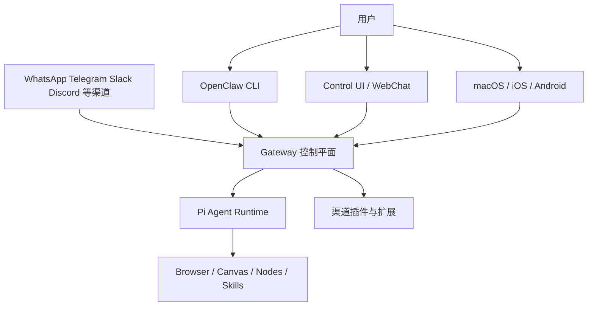
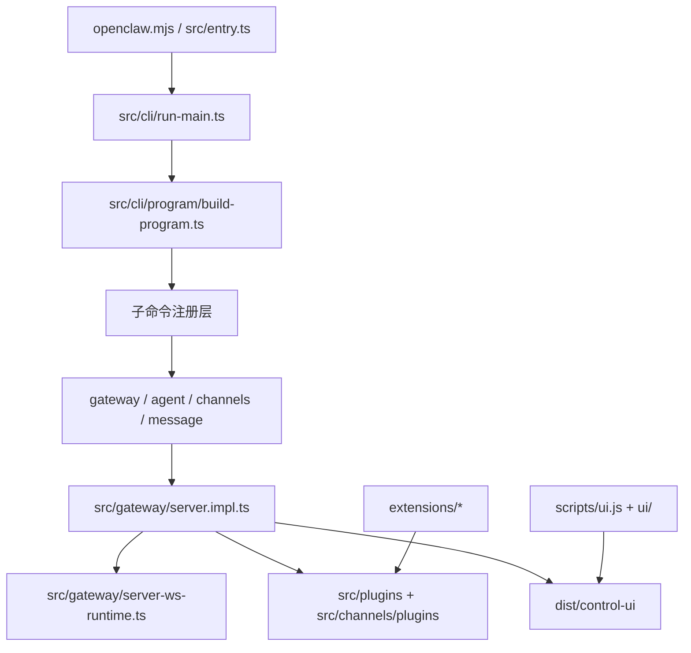
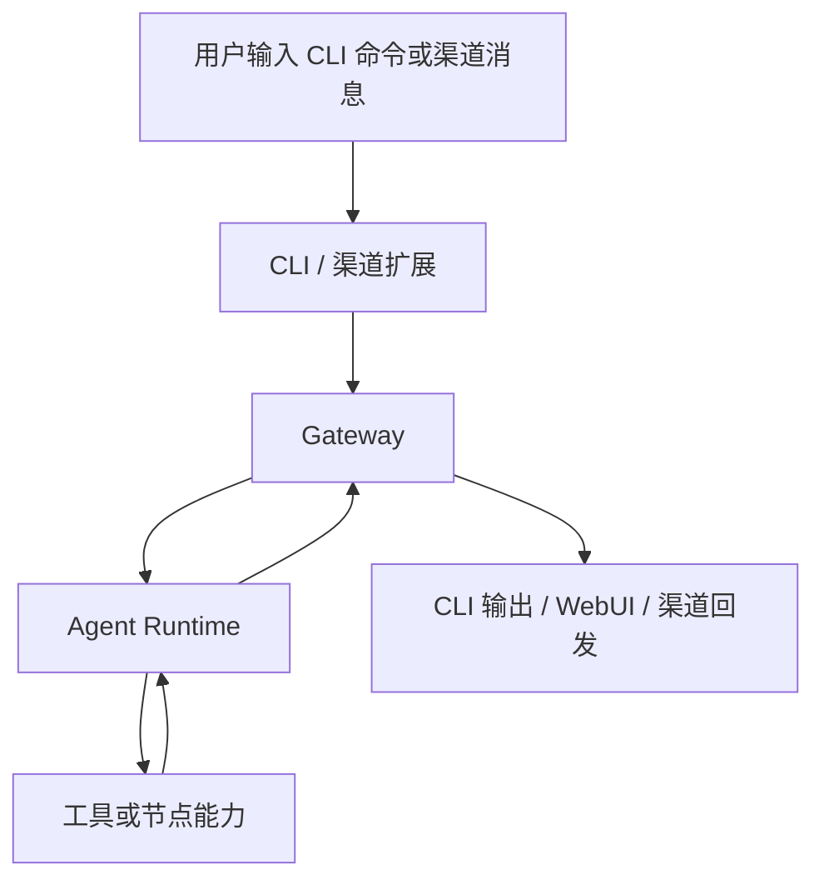
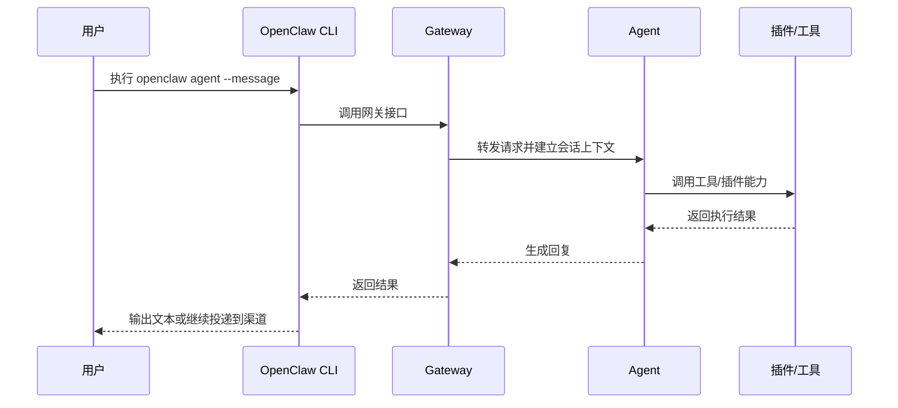

# OpenClaw 技术方案

## 1. 项目概述
- 项目定位：`OpenClaw` 是一个运行在用户自有设备上的个人 AI 助手，核心产品形态不是单一聊天界面，而是一个可连接多消息渠道、设备节点、Web 界面和工具能力的本地控制平面。
- 目标用户与场景：适合希望把 AI 助手接入 `WhatsApp`、`Telegram`、`Slack`、`Discord`、`WebChat`、移动设备或桌面端，并长期在线运行的个人用户或高级开发者。
- 当前系统目标：通过本地 `Gateway` 统一承载会话、渠道、插件、Web 控制台、Agent 调度与设备能力，再由 CLI、UI、移动端和扩展共同消费这一控制平面。

## 2. 现状分析
### 2.1 项目形态
- 这是一个以 `TypeScript` 为主的 `pnpm workspace` 多包工程。
- 根包 `openclaw` 是主运行时与 CLI 工程。
- `ui` 是独立的控制台前端子工程。
- `extensions/*` 是渠道或能力扩展包。
- `packages/*` 中的 `clawdbot`、`moltbot` 更像兼容层或转发封装。
- `apps/android`、`apps/ios`、`apps/macos` 是原生端工程，但不在 `pnpm-workspace.yaml` 的 workspace 列表中，属于主仓下的独立平台目录。

### 2.2 当前技术栈
- 运行时：`Node.js >= 22.12.0`
- 包管理：`pnpm@10.23.0`
- 语言：`TypeScript` + 少量 `JavaScript`
- CLI：`commander`
- Web/Gateway：`ws`、`express`、`hono`
- UI：`Vite` + `Lit`
- 测试：`vitest`
- 代码质量：`oxlint`、`oxfmt`
- 移动与桌面：Android/Swift/macOS 原生工程

### 2.3 系统边界
- 已实现：CLI、Gateway、Agent、插件体系、Web 控制台、WebChat、移动/桌面配套、技能系统、多个渠道扩展。
- 明确边界：很多渠道能力依赖真实第三方账号、令牌、设备权限和外部服务，无法在脱离配置的本地环境中完整验证。

### 2.4 命令面现状
- 仓库内存在离线命令参考：`myDocs/openclaw_command.md`
- 该文档明确说明内容由 CLI 的 `--help` / `-h` 输出整理而来，可作为技术方案中的命令分层与验证入口事实来源。
- 从命令参考可见，`OpenClaw` 的 CLI 命令至少分为以下几类：
  - 初始化与引导：`setup`、`onboard`、`configure`
  - 诊断与修复：`doctor`、`status`、`health`、`logs`
  - 核心运行：`gateway`、`daemon`
  - AI 与会话：`agent`、`agents`、`sessions`
  - 消息与渠道：`message`、`channels`、`pairing`
  - 扩展能力：`browser`、`skills`、`plugins`、`models`、`nodes`

## 3. 总体架构设计
### 3.1 架构目标
- 把“多渠道消息入口、Agent 能力、工具调用、设备能力、Web 控制台”统一到一个本地控制平面中。
- 让 CLI、Web UI、移动节点和扩展都围绕同一套会话与网关协议协作。
- 同时支持开发态从源码运行和发布态从构建产物运行。

### 3.2 架构原则
- Gateway 中心化：控制面统一。
- 渠道插件化：每个渠道尽量独立封装。
- CLI 优先：安装、调试、运维、日常交互都可通过 CLI 进入。
- 平台分层：核心运行时、UI、扩展、原生端相对解耦。
- 本地优先：默认状态目录、认证信息、工作空间都偏向用户本机。

### 3.3 业务架构图

### 3.4 技术架构图

## 4. 核心功能与代码定位
### 4.1 CLI 启动链
- 功能目标：提供统一命令入口，并在源码态/发布态之间桥接。
- 入口位置：`openclaw.mjs`
- 对应文件：
  - `openclaw.mjs`
  - `src/entry.ts`
  - `src/cli/run-main.ts`
  - `src/cli/program/build-program.ts`
- 设计说明：
  - `openclaw.mjs` 先设置 `OPENCLAW_STATE_DIR`，在 Windows 上默认落到 `%USERPROFILE%\.openclaw`。
  - 然后导入 `dist/entry.js`，进入正式启动链。
  - `src/entry.ts` 负责 Windows 参数归一化、环境整理与 CLI 启动。
  - `runCli()` 再决定是否直接路由子命令，还是构造完整的 Commander 程序。
- 新手先看什么：先看 `openclaw.mjs`，再看 `src/entry.ts`。
- 看懂后的收获：能掌握“为什么一个命令行工具还要处理状态目录、Windows 参数、二次导入与运行时保护”。

### 4.2 命令注册与子命令体系
- 功能目标：把大量命令按模块化方式注册到一个统一 CLI 上。
- 入口位置：`src/cli/program/build-program.ts`
- 对应文件：
  - `src/cli/program/build-program.ts`
  - `src/cli/program/command-registry.ts`
  - `src/cli/program/register.agent.ts`
  - `src/cli/gateway-cli/run.ts`
- 调用关系：`buildProgram()` -> `registerProgramCommands()` -> 各子命令注册器。
- 新手先看什么：`build-program.ts`，再顺着 `command-registry.ts` 找到 `agent`、`gateway` 等注册器。
- 看懂后的收获：能快速找到任何 CLI 子命令的真实入口。

### 4.3 Gateway 控制平面
- 功能目标：承接 WebSocket、渠道、会话、插件、Web UI 和 Agent 调度，是整个系统的控制中枢。
- 入口位置：`openclaw gateway`
- 对应文件：
  - `src/cli/gateway-cli/run.ts`
  - `src/gateway/server.ts`
  - `src/gateway/server.impl.ts`
  - `src/gateway/server-ws-runtime.ts`
- 调用关系：CLI 的 gateway 子命令进入 `runGatewayCommand()`，再调用 `startGatewayServer()`，随后在 `server.impl.ts` 中装配 WS、插件、渠道和运行时能力。
- 新手先看什么：`src/cli/gateway-cli/run.ts` -> `src/gateway/server.impl.ts`
- 看懂后的收获：理解项目为什么把 Gateway 定义为“控制平面”。

### 4.4 Agent 通过 Gateway 工作
- 功能目标：让用户可直接通过 CLI 与 Agent 对话，或把结果投递回已有渠道。
- 入口位置：`openclaw agent`
- 对应文件：
  - `src/cli/program/register.agent.ts`
  - `src/commands/agent-via-gateway.ts`
  - `src/commands/agent.ts`
  - `src/gateway/call.ts`
- 设计说明：
  - 默认路径偏向“经 Gateway 调 Agent”。
  - 某些模式支持本地嵌入式 Agent 运行。
- 新手先看什么：`register.agent.ts` 和 `agent-via-gateway.ts`
- 看懂后的收获：能理解 CLI、Gateway、Agent 三层关系，而不是把它们误认为单体脚本。

### 4.5 渠道插件与扩展体系
- 功能目标：把 Telegram、Slack、Discord、Matrix 等渠道以插件方式接入。
- 入口位置：`src/channels/plugins/index.ts`
- 对应文件：
  - `src/channels/plugins/index.ts`
  - `src/plugins/runtime.ts`
  - `extensions/*`
  - `src/gateway/server.impl.ts`
- 设计说明：Gateway 运行时通过插件注册表发现可用渠道插件，再把这些插件的方法、状态与控制能力接入主服务。
- 新手先看什么：先看 `src/channels/plugins/index.ts`，再任选一个 `extensions/<channel>`。
- 看懂后的收获：理解项目如何在不破坏核心运行时的前提下扩展新渠道。

### 4.6 Web 控制台与 UI 构建
- 功能目标：提供浏览器可视化控制界面，并把构建产物输出到 Gateway 可直接服务的目录。
- 入口位置：`ui/package.json` 与 `scripts/ui.js`
- 对应文件：
  - `ui/package.json`
  - `ui/vite.config.ts`
  - `scripts/ui.js`
  - `dist/control-ui`
- 设计说明：`scripts/ui.js` 会在 UI 依赖缺失时自动安装，再调用 `pnpm run build/dev/test`；UI 构建目标是 `dist/control-ui`，与主工程发布产物衔接。
- 新手先看什么：`scripts/ui.js`，然后看 `ui/package.json`
- 看懂后的收获：理解前端为什么没有完全独立部署，而是作为 Gateway 的一部分交付。

### 4.7 命令体系就是产品能力目录
- 功能目标：把安装、配置、诊断、消息操作、Agent 调度和浏览器自动化等能力统一暴露为 CLI。
- 入口位置：`myDocs/openclaw_command.md` 与 `openclaw --help`
- 对应命令簇：
  - 引导：`openclaw setup`、`openclaw onboard`、`openclaw configure`
  - 诊断：`openclaw doctor`、`openclaw status`、`openclaw health`
  - 服务：`openclaw gateway`、`openclaw daemon`、`openclaw logs`
  - 交互：`openclaw agent`、`openclaw message send`
  - 自动化与工具：`openclaw browser`、`openclaw skills`、`openclaw models`
- 设计说明：
  - `setup` / `onboard` 表明项目提供了向导式初始化路径，而不是要求用户直接手工编辑所有配置。
  - `doctor` / `status` / `health` 表明项目内置了运维诊断与健康检查能力。
  - `message` 与 `browser` 拥有大量子命令，说明 OpenClaw 同时覆盖消息自动化与浏览器自动化两条产品能力线。
- 新手先看什么：先读根命令列表，再看 `onboard`、`doctor`、`gateway`、`agent`、`message send`
- 看懂后的收获：先从“用户如何操作系统”理解项目，再回到源码理解“命令如何实现”

## 5. 核心模块设计
### 5.1 CLI 层
- 职责：命令解析、帮助信息、子命令注册、运行时入口封装。
- 输入输出：输入是命令行参数，输出是本地控制动作、网关调用或用户可见结果。
- 关键代码定位：`openclaw.mjs`、`src/entry.ts`、`src/cli/*`
- 推荐阅读顺序：`openclaw.mjs` -> `src/entry.ts` -> `src/cli/run-main.ts` -> `src/cli/program/*`

### 5.2 Gateway 层
- 职责：承载系统主循环、通信协议、插件接入、运行状态和 Web 能力。
- 输入输出：输入来自 CLI、Web UI、设备节点、各类渠道；输出是会话响应、事件分发、控制接口和静态资源服务。
- 关键代码定位：`src/gateway/server.impl.ts`、`src/gateway/server-ws-runtime.ts`
- 推荐阅读顺序：先看 `server.impl.ts` 的 import 和装配逻辑，再看 WS 运行时。

### 5.3 插件/渠道层
- 职责：屏蔽不同渠道 SDK 差异，向 Gateway 提供统一接入面。
- 输入输出：输入是各平台消息事件；输出是统一化的渠道能力与网关方法。
- 关键代码定位：`src/channels/plugins/index.ts`、`extensions/*`
- 推荐阅读顺序：先看插件注册表，再看单个渠道扩展。

### 5.4 UI 层
- 职责：提供控制台、WebChat 及配套前端视图。
- 输入输出：输入来自用户浏览器和网关状态；输出是 `dist/control-ui` 静态产物与前端交互界面。
- 关键代码定位：`ui/`、`scripts/ui.js`

### 5.5 命令与运维层
- 职责：把初始化、诊断、服务控制、消息发送、Agent 调度和浏览器控制统一暴露为 CLI 能力。
- 输入输出：输入是用户命令与参数；输出是状态、诊断、消息投递结果、会话结果或服务控制动作。
- 关键命令定位：
  - `openclaw setup`
  - `openclaw onboard`
  - `openclaw doctor`
  - `openclaw status`
  - `openclaw health`
  - `openclaw gateway`
  - `openclaw agent`
  - `openclaw message send`
  - `openclaw browser`
- 推荐阅读顺序：先读离线命令参考，再映射到 `src/cli/program/*` 与对应命令实现文件

## 6. 数据与接口设计
### 6.1 本地状态与配置
- 默认状态目录：Windows 下优先 `%USERPROFILE%\.openclaw`
- 配置来源：README、CLI 约定、本地状态目录下配置文件
- 凭据与工作区：
  - 工作区默认可配置到 `~/.openclaw/workspace`
  - 渠道凭据、配对信息、技能内容都围绕该本地状态区展开

### 6.2 核心数据流

### 6.3 关键时序图

## 7. 关键技术选型
| 选型项 | 当前选型 | 适用原因 | 风险或限制 |
|---|---|---|---|
| Node 运行时 | `Node 22+` | 统一 CLI、Gateway、构建链 | Windows/WSL 与脚本兼容性要注意 |
| 包管理 | `pnpm workspace` | 适合多包与扩展管理 | 新手初次理解成本较高 |
| CLI 框架 | `commander` | 子命令生态成熟 | 命令层较深时阅读跨度大 |
| UI | `Vite` + `Lit` | 轻量、构建快 | 与主工程耦合在同一发布流程 |
| 网关通信 | `WebSocket` | 适合控制平面和实时状态交互 | 真实部署时要考虑认证和暴露面 |

## 8. 非功能设计
- 安全性：README 明确把来自真实渠道的 DM 视为不可信输入，并提供配对、白名单、沙箱等策略。
- 性能：多渠道、多插件、多设备节点共用 Gateway，有利于减少重复进程和状态分裂。
- 可维护性：多包工作区与插件化结构有利于扩展，但目录较大，新人需要阅读顺序引导。
- 可观测性：内置 `doctor`、`health`、日志、状态命令和 UI 控制面。

## 9. 部署与发布建议
- 日常开发建议：
  - 源码开发优先使用 `pnpm`
  - Windows 环境优先采用 `WSL2`
- 命令使用建议：
  - 首次接触项目时，优先按 `myDocs/openclaw_command.md` 建立命令地图
  - 初始化优先走 `setup` / `onboard`
  - 运维排障优先走 `doctor` / `status` / `health` / `logs`
- 发布形态：
  - CLI/主运行时走 `dist/`
  - UI 构建输出到 `dist/control-ui`
  - 原生应用通过各自平台工具链构建
- 风险提示：
  - 纯 Windows 下某些 `bash` 脚本无法直接工作
  - iOS/macOS 构建显然依赖 Apple 工具链
  - 部分测试脚本依赖 Docker 或真实外部服务

## 10. 项目运行指南
### 10.1 运行前准备
- 已验证环境：
  - `node --version` -> `v24.14.1`
  - `pnpm --version` -> `10.23.0`
- 建议环境：
  - Windows 下优先使用 `WSL2`
  - 若在原生 Windows 运行，请确认 `pnpm`、Node、以及可能需要的 `bash` 环境已具备

### 10.2 本地运行步骤
- 建议命令：
  - `pnpm install`
  - `pnpm ui:build`
  - `pnpm build`
  - `pnpm gateway:watch`
- 仅阅读/轻量验证时可尝试：
  - `node .\openclaw.mjs --help`
  - `node .\openclaw.mjs gateway -h`
  - `node .\openclaw.mjs doctor -h`
  - `node .\openclaw.mjs agent -h`
  - `node .\openclaw.mjs message send -h`
  - `pnpm openclaw --help`
- 按命令文档推导出的推荐使用路径：
  1. `openclaw setup` 或 `openclaw onboard`
  2. `openclaw gateway --port 18789`
  3. `openclaw doctor`
  4. `openclaw status` / `openclaw health`
  5. `openclaw agent --message "..."`
  6. `openclaw message send ...`

### 10.3 测试与验证
- 仓库内真实存在的测试命令：
  - `pnpm test`
  - `pnpm test:e2e`
  - `pnpm test:ui`
  - `pnpm check`
- 仓库内真实存在的低风险命令入口：
  - `openclaw --help`
  - `openclaw doctor -h`
  - `openclaw agent -h`
  - `openclaw message send -h`
  - `openclaw status`
  - `openclaw health`
  - `openclaw browser status`
- 实际验证记录：
  - 已执行 `node --version`，成功返回 `v24.14.1`
  - 已执行 `pnpm --version`，成功返回 `10.23.0`
  - 已执行 `node .\openclaw.mjs --help`，帮助内容已输出，说明 CLI 主入口和构建产物可被加载；但该进程在当前环境下长时间未自然退出，约 83 秒后人工停止，因此本次不将其记为“完全成功结束”
- 验证边界说明：
  - `onboard`、`setup`、`configure` 天然偏交互式，且可能涉及密钥、账户与设备绑定，不适合在当前自动化环境中完整跑通
  - `status`、`health`、`browser status` 等命令需要 Gateway 或相关服务已运行，未运行时应视为“依赖未满足”，不是命令文档错误

### 10.4 常见问题
- 现象：命令在 Windows 原生环境下表现不稳定或依赖 `bash`
  - 排查：优先切换到 `WSL2`
- 现象：某些渠道无法启动
  - 排查：检查令牌、账户、设备登录态与本地状态目录
- 现象：UI 无法构建
  - 排查：检查 `pnpm` 是否可用，以及 `scripts/ui.js` 是否能自动完成 UI 依赖安装

## 11. 新手学习路径
### 11.1 建议阅读顺序
1. `myDocs/openclaw_command.md`
2. `README.md`
3. `openclaw.mjs`
4. `src/entry.ts`
5. `src/cli/run-main.ts`
6. `src/cli/program/build-program.ts`
7. `src/gateway/server.impl.ts`
8. `src/commands/agent-via-gateway.ts`
9. `src/channels/plugins/index.ts`
10. `scripts/ui.js` 与 `ui/`

### 11.2 必备术语解释
- Gateway：系统的控制平面，负责把各类入口和内部能力接起来。
- 插件注册表：系统用来发现和管理可用渠道扩展的地方。
- Control UI：Gateway 附带的浏览器控制界面。
- 节点：运行在用户设备上的配套能力承载端，例如移动端或桌面端。

### 11.3 调试与观察建议
- 断点入口：
  - `src/entry.ts`
  - `src/cli/run-main.ts`
  - `src/gateway/server.impl.ts`
- 观察重点：
  - CLI 参数如何被归一化
  - Gateway 如何装配插件与 WS
  - Agent 请求如何经 Gateway 往返

### 11.4 从小任务入门
- 第一个小任务：新增或修改一个 CLI 帮助文案
- 第二个小任务：阅读并调整 `scripts/ui.js` 的自动安装逻辑
- 第三个小任务：挑一个 `extensions/*` 渠道，追踪注册过程

## 12. 风险与演进建议
### 12.1 当前风险
- Windows 原生环境与 `bash` 脚本之间有兼容性张力。
- 功能面很广，首次接触者容易把 CLI、Gateway、Agent、UI 视作一个“黑盒”。
- 多渠道与外部账号依赖使得完整回归验证成本较高。

### 12.2 短期建议
- 为 Windows 原生开发提供更明确的“可运行命令矩阵”。
- 给 `--help` 等只读命令补充更稳定的退出行为与 smoke test。
- 在仓库内补一份面向贡献者的核心源码阅读地图。

### 12.3 中长期演进方向
- 进一步收敛平台构建说明，降低原生端与核心工程的认知割裂。
- 把插件生命周期、网关协议与 UI 资源关系做成更清晰的开发文档。

## 13. 事实、推断与待确认项
### 13.1 已验证事实
- `pnpm-workspace.yaml` 明确包含 `.`, `ui`, `packages/*`, `extensions/*`
- `openclaw.mjs` 在 Windows 上会优先设置 `%USERPROFILE%\.openclaw`
- 根包 `package.json` 声明 `Node >= 22.12.0`、`pnpm@10.23.0`
- `ui/package.json` 采用 `Vite` 和 `Lit`
- `scripts/ui.js` 明确支持在 Windows 上通过 `shell: true` 调用 `pnpm`
- `myDocs/openclaw_command.md` 明确来自 CLI `--help` / `-h` 输出整理
- 根命令层面至少包含 `setup`、`onboard`、`doctor`、`message`、`agent`、`gateway`、`status`、`health`、`browser` 等命令簇

### 13.2 推断项
- 项目整体属于“核心 TS 主运行时 + UI 子工程 + 扩展包 + 原生端”的混合多包架构。
- `agent` 的主推荐路径是经 Gateway 工作，而非纯本地单体模式。

### 13.3 待确认项
- `node .\openclaw.mjs --help` 在当前环境下未自然退出的根因，是否与某些初始化逻辑、插件注册或环境差异有关。
- 纯 Windows 原生环境下 `pnpm build` 对 `bash scripts/bundle-a2ui.sh` 的兼容情况是否稳定。
- 需要真实账号、GUI、设备权限的完整链路仍未在本次环境中跑通。

## 14. 开放性问题

1. `openclaw agent` 当前更偏向“经 Gateway 调 Agent”，但本地嵌入式 Agent 路径也仍然存在，二者未来的主次关系与职责边界是否需要进一步收敛？
2. `openclaw.mjs --help` 在当前环境中可输出帮助但未自然退出，这究竟是命令实现特性、初始化副作用，还是某类插件/运行时未及时释放导致？
3. 项目文档目前建议 Windows 优先走 `WSL2`，那么“原生 Windows 支持”究竟是过渡兼容、受限支持，还是未来需要正式补齐的一等路径？
4. Gateway、渠道插件、节点能力、Web UI 共享一个控制平面后，插件生命周期、鉴权边界和故障隔离是否已经足够清晰？
5. `status`、`health`、`browser status` 等只读命令对外部依赖的最小要求，是否可以进一步固化为一套稳定的本地验证矩阵？
